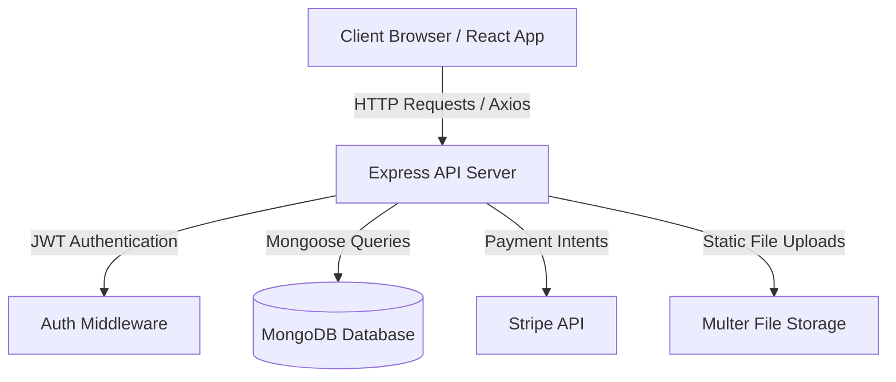

# 🏠 NestFinder – Property Rental Management System

A full-stack property rental platform built with **React, Node.js, Express, and MongoDB (Mongoose)**, featuring role-based dashboards for Admins, Owners, and Tenants.

[](https://github.com/Prabhat8910/Property-Rental-System.git)

---

## 📖 1. Project Overview

**NestFinder** is a modern full-stack web application designed to streamline property rental operations. It enables property owners to list and manage rental properties, tenants to search, book, and pay for properties securely, and administrators to monitor platform activity and user operations.

---

## 📸 2. Features at a Glance

| Feature | Details |
|---|---|
| **Authentication** | JWT-based login/register with bcrypt password hashing |
| **Role-Based Access** | Admin · Owner · Tenant |
| **Property Listings** | Add/edit/delete listings with image upload, filters, and search |
| **Booking System** | Calendar date selection with date-overlap conflict validation |
| **Stripe Payments** | Card payments via Stripe API, payment history, and webhooks |
| **Maintenance Requests** | Tenants raise issue tickets · Owners review & respond |
| **Reviews & Ratings** | Verified tenant reviews tied to property bookings |
| **Notifications** | In-app notification alerts for bookings, payments, & maintenance |
| **Wishlist** | Save and manage favorite properties |
| **Admin Panel** | User management, revenue analytics, and system overview |
| **Responsive UI** | Mobile-friendly React + Tailwind CSS dashboard |

---

## 🧱 3. Tech Stack

| Layer | Technology |
|---|---|
| **Frontend** | React 18, Vite, Tailwind CSS, React Router v6 |
| **Charts** | Recharts |
| **HTTP Client** | Axios |
| **Payments** | Stripe.js + React Stripe Integration |
| **Backend** | Node.js, Express.js |
| **Database** | MongoDB + Mongoose ODM |
| **Authentication** | JSON Web Tokens (JWT) + bcryptjs |
| **File Upload** | Multer |
| **Email** | Nodemailer |
| **Validation** | express-validator |

---

## 🗂️ 4. Project Structure

```text
property-rental/
├── backend/
│   ├── src/
│   │   ├── config/        # Mongoose database connection, seeder, migration
│   │   ├── controllers/   # Business logic (auth, property, booking, payment...)
│   │   ├── middleware/    # JWT auth, error handling, upload middleware
│   │   ├── models/        # Mongoose schemas (User, Property, Booking...)
│   │   ├── routes/        # Express API endpoints
│   │   ├── utils/         # Helper functions (email, notifications)
│   │   └── server.js      # Express server entry point
│   ├── uploads/           # Uploaded property images
│   ├── .env.example       # Backend environment variables template
│   └── package.json
├── frontend/
│   ├── src/
│   │   ├── components/    # Reusable UI components & layouts
│   │   ├── context/       # AuthContext for global session state
│   │   ├── pages/         # Auth, Tenant, Owner, and Admin pages
│   │   └── services/      # Axios API service instances
│   ├── .env.example       # Frontend environment variables template
│   └── package.json
└── docs/
    └── API.md             # Detailed API documentation
```

---

## ⚙️ 5. Architecture / Workflow



---

## 🗄️ 6. Database (MongoDB & Mongoose Models)

The backend uses **MongoDB** managed via **Mongoose** models located in `backend/src/models/`:

| Collection / Model | Purpose | Key References |
|---|---|---|
| `users` | User accounts, roles, and profiles | Independent |
| `properties` | Property listings, prices, images, amenities | `owner_id` → `User` |
| `bookings` | Property booking requests & date ranges | `tenant_id` → `User`, `property_id` → `Property` |
| `payments` | Stripe payment intents & receipt logs | `booking_id` → `Booking`, `tenant_id` → `User` |
| `maintenance_requests` | Tenant issue tickets & owner resolutions | `property_id` → `Property`, `tenant_id` → `User` |
| `reviews` | Property ratings and tenant comments | `user_id` → `User`, `property_id` → `Property`, `booking_id` → `Booking` |
| `notifications` | User in-app notifications inbox | `user_id` → `User` |
| `wishlists` | Saved favorite properties per user | `user_id` → `User`, `property_id` → `Property` |
| `messages` | Direct tenant-owner communications | `sender_id` → `User`, `receiver_id` → `User` |

---

## 🔐 7. Authentication

- **Registration & Login**: Secure user registration with password hashing (`bcryptjs`).
- **Session Management**: Statess JWT authentication via `Authorization: Bearer <token>` header.
- **Role Guards**: Backend `authorize('admin', 'owner', 'tenant')` middleware enforces strict role-based authorization for all protected routes.

---

## 📅 8. Booking Workflow & Date Conflict Validation

1. **Tenant Booking Request**: Tenant selects `check_in` and `check_out` dates on a property.
2. **Conflict Overlap Check**: The system validates that no existing booking with status `pending` or `confirmed` overlaps with the requested date range:
   $$\text{check\_in} < \text{requested\_check\_out} \quad \text{AND} \quad \text{check\_out} > \text{requested\_check\_in}$$
3. **Owner Decision**: Owner accepts or rejects the booking request from their dashboard.
4. **Activation**: Upon owner acceptance and payment completion, the booking status transitions to `confirmed`.

---

## 💳 9. Stripe Payment Workflow

1. **Intent Creation**: Backend generates a Stripe PaymentIntent (`/api/payments/create-intent`).
2. **Frontend Payment**: Tenant submits card details securely via Stripe.
3. **Confirmation**: Payments are confirmed on the backend (`/api/payments/confirm`) or via Stripe Webhook handlers (`/api/payments/webhook`).
4. **Development Fallback**: Seamless mock payment mode is built-in for local development without active Stripe live keys.

---

## 🔧 10. Maintenance Workflow

1. **Issue Creation**: Tenant submits a maintenance ticket for a booked property with category, priority, description, and optional images.
2. **Owner Review**: Property owner receives an in-app notification and views the ticket in their dashboard.
3. **Status Update**: Owner updates ticket status (`open` $\rightarrow$ `in_progress` $\rightarrow$ `resolved`) and adds notes.

---

## 🌐 11. API Overview

Full API documentation is available in [`docs/API.md`](docs/API.md).

### Main Endpoints Summary:
- `POST /api/auth/register` – Register user
- `POST /api/auth/login` – Authenticate user & receive JWT
- `GET /api/properties` – Search & list properties
- `POST /api/properties` – Create property listing (Owner/Admin)
- `POST /api/bookings` – Submit property booking request
- `PUT /api/bookings/:id/status` – Accept/reject booking (Owner)
- `POST /api/payments/create-intent` – Initialize Stripe payment
- `POST /api/payments/confirm` – Finalize payment
- `POST /api/maintenance` – Raise maintenance ticket
- `GET /api/admin/dashboard` – Fetch platform statistics (Admin)

---

## ⚙️ 12. Prerequisites

- **Node.js** v18+
- **MongoDB** v6.0+ (Local MongoDB instance or MongoDB Atlas cluster)
- **npm** v9+

---

## 🚀 13. Installation & Setup Instructions

### 1. Clone the repository

```bash
git clone https://github.com/Prabhat8910/Property-Rental-System.git
cd property-rental
```

### 2. Backend Setup

```bash
cd backend
npm install
cp .env.example .env
```

Configure `backend/.env`:
```env
PORT=5000
NODE_ENV=development
MONGODB_URI=mongodb://localhost:27017/property_rental
JWT_SECRET=your_jwt_secret_key
STRIPE_SECRET_KEY=sk_test_your_key
STRIPE_WEBHOOK_SECRET=whsec_your_key
FRONTEND_URL=http://localhost:5173
```

**Seed Demo Data into MongoDB:**
```bash
npm run seed
```

**Start Backend Server:**
```bash
npm run dev
```
*(Backend runs at `http://localhost:5000`)*

### 3. Frontend Setup

Open a new terminal:
```bash
cd frontend
npm install
cp .env.example .env
```

Configure `frontend/.env`:
```env
VITE_STRIPE_PUBLISHABLE_KEY=pk_test_your_key
```

**Start Frontend Server:**
```bash
npm run dev
```
*(Frontend runs at `http://localhost:5173`)*

---

## 🔐 14. Demo Credentials

After running `npm run seed`, log in with these pre-seeded test accounts:

| Role | Email | Password |
|---|---|---|
| **Admin** | `admin@rental.com` | `Password123!` |
| **Owner** | `owner1@rental.com` | `Password123!` |
| **Tenant** | `tenant1@rental.com` | `Password123!` |

---

## 💳 15. Stripe Test Cards

| Card Type | Number | Expiry | CVV |
|---|---|---|---|
| **Success** | `4242 4242 4242 4242` | Any future date (e.g. `12/28`) | `123` |
| **Declined** | `4000 0000 0000 0002` | Any future date | `123` |

---

## 🚀 16. Deployment

### Frontend (Vercel)
1. Import repository to Vercel.
2. Set Root Directory to `frontend`.
3. Set Environment Variable `VITE_STRIPE_PUBLISHABLE_KEY`.
4. Deploy.

### Backend (Render / Railway)
1. Connect repository to Render / Railway.
2. Set Root Directory to `backend`.
3. Build Command: `npm install`
4. Start Command: `npm start`
5. Configure Environment Variables: `MONGODB_URI`, `JWT_SECRET`, `STRIPE_SECRET_KEY`, `FRONTEND_URL`.

### Database (MongoDB Atlas)
1. Create a free cluster on MongoDB Atlas.
2. Obtain connection URI and paste it into `MONGODB_URI` environment variable.

---

## 🔧 17. Available Scripts

### Backend (`backend/package.json`)
| Command | Description |
|---|---|
| `npm run dev` | Start Express server with nodemon |
| `npm start` | Start Express server in production |
| `npm run migrate` | Initialize MongoDB schemas and indexes |
| `npm run seed` | Populate MongoDB database with test data |

### Frontend (`frontend/package.json`)
| Command | Description |
|---|---|
| `npm run dev` | Start Vite development server |
| `npm run build` | Build production bundle |
| `npm run preview` | Locally preview production build |

---

## 🛣️ 18. Roadmap

- [ ] Real-time chat (Socket.io) between tenant & owner
- [ ] Google Maps integration for property locations
- [ ] Email notifications for booking confirmation (Nodemailer)
- [ ] PDF rent receipt generation
- [ ] Multi-currency support

---

## 📄 19. License

This project is licensed under the **MIT License** — free for personal and educational use.
